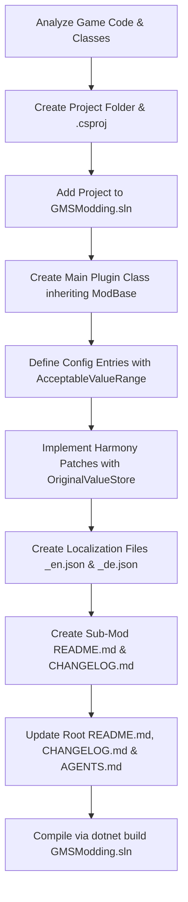

# Milex GMS1 Mod Architecture & AI Agent Sub-Mod Development Blueprint

> **Notice for AI Coding Agents**:
> This document is an authoritative system specification and blueprint for creating new sub-mods for **Gold Mining Simulator** (*Gold Rush: The Game*) within the **Milex GMS1 CoreMod Framework**.
> When given a mod idea, game code excerpts, or decompiled classes, follow every instruction, convention, and architectural pattern defined in this document to create a 100% framework-compliant sub-mod.

---

## 1. System Role & Architecture Overview

All mods in this repository operate under a unified monorepo framework built upon **.NET Standard 2.0**, **BepInEx 5.4.x**, and **Harmony 2.x**.

### Core Pillars
1. **Centralized Lifecycle (`ModBase`)**: Every sub-mod is a `BaseUnityPlugin` that inherits from `Milex.GMS1.Core.ModBase`. CoreMod coordinates mod discovery, registration, and runtime state.
2. **Zero-Code UI Auto-Generation**: Mods never build custom GUI menus for configuration. Declaring settings via BepInEx `Config.Bind(...)` automatically generates rich, interactive cards (sliders, toggles, keybinders, category tabs, and search indexing) in both the **Modern Canvas Dashboard** (uGUI) and the **Classic IMGUI** fallback menu.
3. **Seamless Live Enable/Disable**: Players can toggle any sub-mod on or off at runtime without restarting the game. ModBase automatically handles Harmony unpatching/repatching and stops/resumes MonoBehaviour `Update()` loops.
4. **Original Value Baseline Preservation (`OriginalValueStore`)**: To prevent game-breaking compounding drift, mod patches must **never** multiply live mutable fields in-place without preserving pristine vanilla baselines.
5. **Multi-Language Localization (`LocalizationManager`)**: All user-facing strings (menu labels, descriptions, log messages) are localized using embedded JSON resources automatically unpacked into `BepInEx/plugins/Milex GMS1 Mod Localization/`.
6. **Strict English Standards (Rule 0)**: All code identifiers, C# comments, XML docstrings, BepInEx config sections/keys/descriptions, and markdown documentation must be written in **English only**. Non-English text is strictly isolated to localization files (e.g. `_de.json`).

---

## 2. Directory Structure & Naming Conventions

All sub-mods reside under `src/Mods/<ModName>/`:

```text
d:\Modding\GMSModding\
├── Directory.Build.props              # Shared build properties, game paths, and post-build deploy
├── GMSModding.sln                    # Central Visual Studio solution
├── AGENTS.md                         # Antigravity agent instructions & memory
├── AGENT_MOD_GUIDE.md                # This document (AI Blueprint)
├── DEVELOPER_GUIDE.md                # Human Developer Handbook
├── README.md                         # Monorepo documentation
├── CHANGELOG.md                      # Root changelog
└── src/
    ├── CoreMod/                      # Milex_GMS1_CoreMod (Central manager, UI, Localization)
    └── Mods/
        └── <ModName>/                # Sub-mod folder (e.g., ProductionTuner, EconomyTuner, etc.)
            ├── <AssemblyName>.csproj # e.g., Milex_GMS1_<ModName>.csproj
            ├── <ModName>Plugin.cs    # Main plugin entry point (inherits ModBase)
            ├── Config/               # Config wrapper classes (optional for complex mods)
            ├── Helpers/              # OriginalValueStore, domain helpers
            ├── Localization/         # Embedded JSON files
            │   ├── <AssemblyName>_en.json
            │   └── <AssemblyName>_de.json
            ├── Patches/              # Harmony patch classes
            ├── README.md             # Sub-mod English documentation
            └── CHANGELOG.md          # Sub-mod English changelog
```

### Naming Standards
- **Folder**: `src/Mods/<ModName>` (e.g., `src/Mods/QuickFill`)
- **Assembly Name**: `Milex_GMS1_<ModName>` (e.g., `Milex_GMS1_QuickFill`)
- **Root Namespace**: `Milex.GMS1.Mods.<ModName>`
- **Plugin GUID**: `com.milex.gms1.<modnamesmall>` (e.g., `com.milex.gms1.quickfill`)
- **Plugin Name**: `Milex GMS1 <ModName>` (e.g., `Milex GMS1 Quick Fill`)
- **Plugin Version**: Semantic versioning (e.g., `1.0.0`)

---

## 3. Creating the `.csproj` File

Every sub-mod inherits global build configuration, assembly references, and deployment scripts from `Directory.Build.props`.

Create `src/Mods/<ModName>/Milex_GMS1_<ModName>.csproj`:

```xml
<Project Sdk="Microsoft.NET.Sdk">
  <PropertyGroup>
    <RootNamespace>Milex.GMS1.Mods.<ModName></RootNamespace>
    <AssemblyName>Milex_GMS1_<ModName></AssemblyName>
    <Version>1.0.0</Version>
    <Authors>Milex</Authors>
    <Product>Milex GMS1 <ModName></Product>
    <Description><Clear English description of what the mod does>.</Description>
  </PropertyGroup>

  <ItemGroup>
    <!-- CoreMod Dependency -->
    <ProjectReference Include="..\..\CoreMod\Milex_GMS1_CoreMod.csproj" />
    
    <!-- Embedded Localization JSON Templates -->
    <EmbeddedResource Include="Localization\*.json" />
  </ItemGroup>
</Project>
```

> [!IMPORTANT]
> Do **not** duplicate game references (`Assembly-CSharp`, `UnityEngine`, `BepInEx`, `0Harmony`) in the sub-mod `.csproj`. These are inherited automatically from `Directory.Build.props`.

---

## 4. Main Plugin Entry Point (`ModBase`)

The main plugin class must inherit from `Milex.GMS1.Core.ModBase` and declare dependency on `CorePlugin`:

```csharp
using BepInEx;
using Milex.GMS1.Core;
using UnityEngine.SceneManagement;

namespace Milex.GMS1.Mods.<ModName>
{
    [BepInPlugin(PluginGuid, PluginName, PluginVersion)]
    [BepInDependency(CorePlugin.PluginGuid, BepInDependency.DependencyFlags.HardDependency)]
    public class <ModName>Plugin : ModBase
    {
        public const string PluginGuid = "com.milex.gms1.<modnamesmall>";
        public const string PluginName = "Milex GMS1 <ModName>";
        public const string PluginVersion = "1.0.0";

        public override string ModGuid => PluginGuid;
        public override string ModName => PluginName;
        public override string ModVersion => PluginVersion;

        public static <ModName>Plugin Instance { get; private set; }

        protected override void Awake()
        {
            Instance = this;

            // 1. Initialize BepInEx Configuration Bindings
            InitializeConfig();

            // 2. Base initialization: creates Harmony instance, registers with ModRegistry,
            // unpacks localization files, and applies Harmony patches if enabled.
            base.Awake();

            // 3. Register scene reload listeners if baseline caches need clearing on game load
            SceneManager.sceneLoaded += OnSceneLoaded;

            LogInfo(Translate("log.ready", $"{PluginName} loaded successfully."));
        }

        private void InitializeConfig()
        {
            // Bind settings here (see Section 5)
        }

        private static void OnSceneLoaded(Scene scene, LoadSceneMode mode)
        {
            // Reset original baseline tracking caches across scene changes
        }

        protected override void OnModEnabled()
        {
            LogInfo(Translate("log.enabled", $"{PluginName} enabled."));
        }

        protected override void OnModDisabled()
        {
            // Revert modified game instances back to original baseline values
            LogInfo(Translate("log.disabled", $"{PluginName} disabled. Original values restored."));
        }

        protected override void OnDestroy()
        {
            SceneManager.sceneLoaded -= OnSceneLoaded;
            base.OnDestroy();
        }
    }
}
```

---

## 5. Configuration & In-Game Menu Auto-Generation

The In-Game Mod Menu scans each mod's `Config` object and automatically builds responsive UI controls.

### 5.1 Supported Control Types

| C# Type | In-Game UI Representation | Configuration Pattern |
|---|---|---|
| `float` | Continuous Slider with text readout + Reset button | `Config.Bind(section, key, defaultVal, new ConfigDescription(desc, new AcceptableValueRange<float>(min, max)))` |
| `int` | Integer Step Slider + Reset button | `Config.Bind(section, key, defaultVal, new ConfigDescription(desc, new AcceptableValueRange<int>(min, max)))` |
| `bool` | Modern Toggle Switch | `Config.Bind(section, key, defaultVal, desc)` |
| `KeyCode` | Interactive Rebinding Card (press key to rebind) | `Config.Bind(section, key, KeyCode.X, desc)` |

### 5.2 Category Tabs & Reset Groups
- The `section` parameter in `Config.Bind(section, key, ...)` groups settings together.
- In the Modern Dashboard, each section creates a distinct category tab at the top and a distinct card group with a **"Reset Group"** button that reverts only that section to defaults.
- Keep section names concise and semantic (e.g., `WashPlants`, `Vehicles`, `General`, `Controls`).

### 5.3 Example Configuration Setup
```csharp
public static ConfigEntry<float> ExcavatorSpeedMultiplier;
public static ConfigEntry<bool> AutoStartEngine;
public static ConfigEntry<int> MaxWorkerCount;
public static ConfigEntry<KeyCode> QuickActionKey;

private void InitializeConfig()
{
    ExcavatorSpeedMultiplier = Config.Bind(
        "Vehicles",
        "Excavator_Speed",
        1.0f,
        new ConfigDescription("Multiplier for excavator arm and bucket movement speed.", new AcceptableValueRange<float>(0.5f, 5.0f))
    );

    AutoStartEngine = Config.Bind(
        "Vehicles",
        "AutoStartEngine",
        false,
        new ConfigDescription("Automatically ignites the vehicle engine when entering.")
    );

    MaxWorkerCount = Config.Bind(
        "Logistics",
        "MaxWorkers",
        5,
        new ConfigDescription("Maximum number of active hired workers.", new AcceptableValueRange<int>(1, 20))
    );

    QuickActionKey = Config.Bind(
        "Controls",
        "QuickActionKey",
        KeyCode.G,
        new ConfigDescription("Hotkey to trigger quick action.")
    );
}
```

---

## 6. Game Patching, Baseline Memory & Memory Safety

> [!CAUTION]
> **The Multiplicative Drift Trap**:
> In Unity / Mono games, mutable component fields (`PlaneVolumeMax`, `Speed`, `Capacity`) retain their values across frames.
> If a Harmony patch does `field *= multiplier` inside `Update()` or when a config slider moves, the value will compound exponentially (`1.5 * 1.5 * 1.5...`), corrupting game balance or causing arithmetic overflows.

### 6.1 The `OriginalValueStore` Pattern
Every sub-mod modifying mutable instance properties must implement a zero-allocation baseline tracker.

```csharp
using System;
using System.Collections.Generic;
using UnityEngine;

namespace Milex.GMS1.Mods.<ModName>.Helpers
{
    public static class OriginalValueStore
    {
        private class TrackedEntry
        {
            public object TargetInstance { get; set; }
            public float OriginalFloat { get; set; }
            public Action<object, float> FloatReapplyAction { get; set; }
        }

        private static readonly Dictionary<int, TrackedEntry> Entries = new Dictionary<int, TrackedEntry>();

        private static int ComputeKey(int id, string key) => (id * 397) ^ key.GetHashCode();

        public static float GetOrRegisterFloat(object instance, string key, float currentValue, Action<object, float> reapplyAction)
        {
            if (instance == null) return currentValue;

            int id = instance is UnityEngine.Object uObj ? uObj.GetInstanceID() : instance.GetHashCode();
            int entryKey = ComputeKey(id, key);

            if (Entries.TryGetValue(entryKey, out var entry))
            {
                return entry.OriginalFloat;
            }

            Entries[entryKey] = new TrackedEntry
            {
                TargetInstance = instance,
                OriginalFloat = currentValue,
                FloatReapplyAction = reapplyAction
            };
            return currentValue;
        }

        public static void RestoreAll()
        {
            foreach (var entry in Entries.Values)
            {
                if (entry.TargetInstance == null) continue;
                if (entry.TargetInstance is UnityEngine.Object uObj && uObj == null) continue;

                entry.FloatReapplyAction?.Invoke(entry.TargetInstance, entry.OriginalFloat);
            }
            Entries.Clear();
        }
    }
}
```

### 6.2 Writing Harmony Patches with Baseline Tracking

Always patch using pristine baselines:

```csharp
[HarmonyPatch(typeof(ExcavatorArmController), "UpdateSpeeds")]
public static class ExcavatorSpeedPatch
{
    [HarmonyPrefix]
    public static void Prefix(ExcavatorArmController __instance)
    {
        if (!<ModName>Plugin.Instance.IsEnabled) return;

        // 1. Read or record the pristine vanilla baseline
        float vanillaSpeed = OriginalValueStore.GetOrRegisterFloat(
            __instance,
            "ArmSpeed",
            __instance.baseSpeed,
            (inst, original) => ((ExcavatorArmController)inst).baseSpeed = original
        );

        // 2. Compute current modified value strictly from pristine baseline
        float multiplier = <ModName>Plugin.ExcavatorSpeedMultiplier.Value;
        __instance.baseSpeed = vanillaSpeed * multiplier;
    }

    public static void RestoreVanilla()
    {
        OriginalValueStore.RestoreAll();
    }
}
```

### 6.3 Infrastructure Protection Rules
1. **Power & Water Consumption**: Speed, throughput, or capacity multipliers must **never** increase `PowerConsumer.ResourceRequest` (electric draw) or `WaterConsumer.ResourceRequest` (water draw). Generators and pumps must operate at vanilla load levels to prevent unexpected blackouts and pressure drops.
2. **Hog Pan Drainage Compensation**: In `HogPanDirtBox.ProcessPlane`, drainage water scales with `PlaneVolumeMax / 7.5f`. If increasing `PlaneVolumeMax`, you must compensate water drain so water drains at vanilla speed (`VanillaPlaneVolumeMax / 7.5f`).
3. **Cascade Safety**: When modifying upstream processing speeds (e.g. buckets or conveyors feeding sluice boxes), downstream processing must provide sufficient headroom (e.g. up to 20.0x) so dependent equipment does not constantly overflow or jam.

---

## 7. Multi-Language Localization System

The CoreMod localization engine automatically maps config settings and custom strings using JSON files.

### 7.1 JSON Key Standards

| Key Type | Key Pattern | Example |
|---|---|---|
| Section Title | `config.<section_lower>.section` | `"config.vehicles.section": "Vehicles"` |
| Setting Label | `config.<section_lower>.<key_lower>.name` | `"config.vehicles.excavator_speed.name": "Excavator Speed"` |
| Setting Description | `config.<section_lower>.<key_lower>.desc` | `"config.vehicles.excavator_speed.desc": "Speed multiplier for arm and bucket."` |
| Custom Log/UI | `<category>.<key_lower>` | `"log.ready": "Ready."` |

### 7.2 Embedded Template Files

Create `Localization/<AssemblyName>_en.json`:
```json
{
  "config.vehicles.section": "Vehicles",
  "config.vehicles.excavator_speed.name": "Excavator Speed Multiplier",
  "config.vehicles.excavator_speed.desc": "Multiplies hydraulic movement and rotation speed.",
  "config.vehicles.autostartengine.name": "Auto-Start Engine",
  "config.vehicles.autostartengine.desc": "Automatically turns the engine on when entering vehicle.",
  "log.ready": "QuickFill initialized and ready.",
  "log.enabled": "QuickFill enabled.",
  "log.disabled": "QuickFill disabled. Restored vanilla behavior."
}
```

Create `Localization/<AssemblyName>_de.json`:
```json
{
  "config.vehicles.section": "Fahrzeuge",
  "config.vehicles.excavator_speed.name": "Bagger Hydraulik-Multiplikator",
  "config.vehicles.excavator_speed.desc": "Multipliziert Bewegungs- und Drehgeschwindigkeit des Baggerarms.",
  "config.vehicles.autostartengine.name": "Automatischer Motorstart",
  "config.vehicles.autostartengine.desc": "Startet den Motor automatisch beim Einsteigen.",
  "log.ready": "QuickFill initialisiert und einsatzbereit.",
  "log.enabled": "QuickFill aktiviert.",
  "log.disabled": "QuickFill deaktiviert. Standardwerte wiederhergestellt."
}
```

Ensure the `.csproj` includes:
```xml
<ItemGroup>
  <EmbeddedResource Include="Localization\*.json" />
</ItemGroup>
```

---

## 8. AI Agent Execution Workflow (Checklist)

When commanded to implement a new sub-mod, perform the steps in this strict order:



### Step-by-Step Details:
1. **Analyze Target Game Classes**: Search `GMS1 Export/` or `Assembly-CSharp` references for target classes, methods, and fields.
2. **Create Project Structure**: Create `src/Mods/<ModName>/` with `.csproj` and subfolders (`Helpers`, `Patches`, `Localization`).
3. **Register in Solution**: Add the project to `GMSModding.sln` using `dotnet sln GMSModding.sln add src\Mods\<ModName>\<AssemblyName>.csproj`.
4. **Implement Plugin**: Create `<ModName>Plugin.cs` inheriting `ModBase`, overriding properties and lifecycle methods.
5. **Implement Patches**: Create Harmony patches with zero-allocation baseline caching (`OriginalValueStore`).
6. **Provide Localizations**: Create `<AssemblyName>_en.json` and `<AssemblyName>_de.json` with keys matching all sections and settings.
7. **Write Documentation**:
   - `src/Mods/<ModName>/README.md`: Following the 7-section user-friendly structure.
   - `src/Mods/<ModName>/CHANGELOG.md`: Initial release log.
8. **Update Monorepo Files**:
   - Root `README.md`: Add row to the Documentation & Navigation table.
   - Root `CHANGELOG.md`: Document the new sub-mod addition.
   - `AGENTS.md`: Update roadmap/active mods list.
9. **Build Verification**: Run `dotnet build GMSModding.sln` and ensure zero errors and zero warnings.
