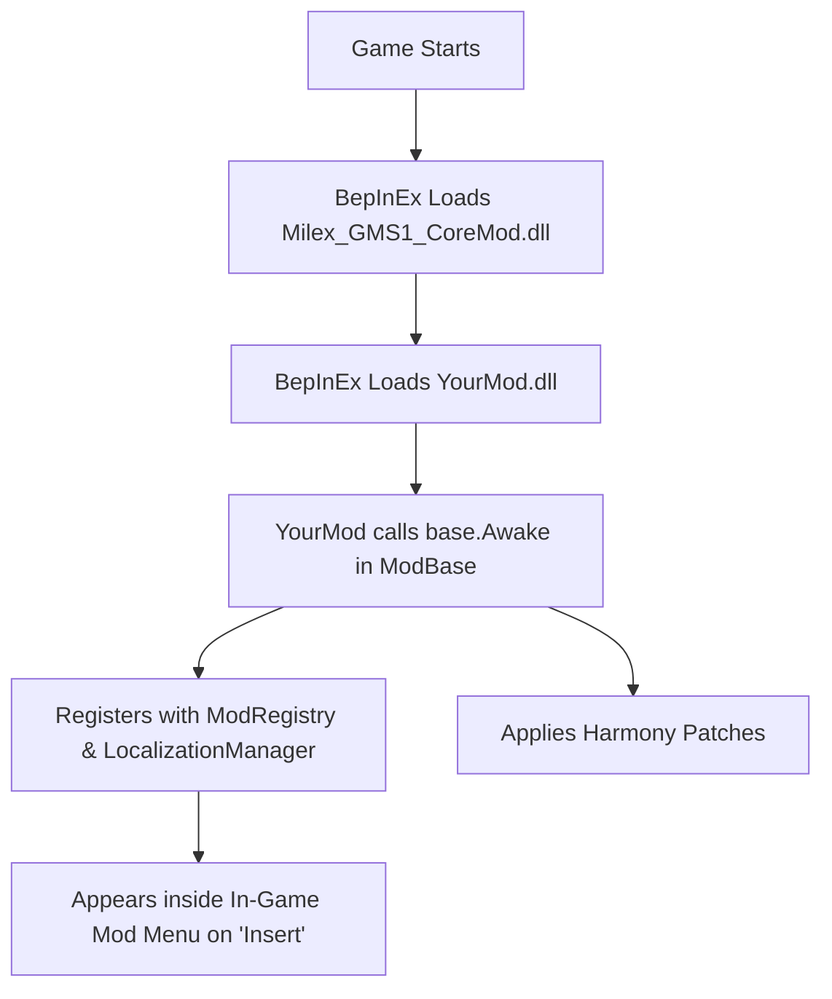

# Milex GMS1 CoreMod - Third-Party Sub-Mod Developer Guide

Welcome to the **Milex GMS1 CoreMod** developer guide!
This handbook is written for **independent modders, creators, and software developers** who want to build their own standalone mod DLLs for **Gold Mining Simulator** (*Gold Rush: The Game*) and have them integrate seamlessly into the Milex CoreMod ecosystem.

---

## 1. How CoreMod & Sub-Mods Work Together

You **do not** need access to the CoreMod source code, nor do you need to modify `Milex_GMS1_CoreMod.dll`.

### How CoreMod Detects and Hooks Your Mod:
1. **BepInEx Plugin Loader**: At game launch, BepInEx scans `BepInEx/plugins/` and loads all DLLs.
2. **Dependency Ordering**: By adding `[BepInDependency("com.milex.gms1.coremod")]`, BepInEx ensures `Milex_GMS1_CoreMod.dll` loads before your mod.
3. **Automatic Registration**: Your mod inherits from `Milex.GMS1.Core.ModBase`. When your plugin starts, `base.Awake()` automatically registers your mod with `ModRegistry`.
4. **Zero-Code UI Integration**: CoreMod inspects your mod's configuration and instantly creates a full-featured dashboard for your mod in the In-Game Mod Menu (**`Insert`** key) — with category tabs, smooth sliders, toggle switches, search filtering, and keybinding rebinders!
5. **Runtime Enable/Disable**: Players can toggle your mod on or off in the in-game sidebar without restarting the game. `ModBase` attaches and detaches your Harmony patches and stops/resumes `Update()` loops automatically.
6. **Built-in Localization**: Your embedded translation files (`_en.json`, `_de.json`) are automatically detected, extracted, and synchronized with the player's selected language.



---

## 2. Prerequisites & Tools

To develop a mod for Gold Mining Simulator using CoreMod:

1. **.NET SDK 6.0 or newer** (supporting `.NET Standard 2.0` class libraries).
2. **Gold Mining Simulator** installed via Steam.
3. **BepInEx 5.4.21+ (x64)** installed in your game root directory (`<GameRoot>/BepInEx/`).
4. **Milex GMS1 CoreMod** installed in `BepInEx/plugins/Milex_GMS1_CoreMod.dll`.
5. An IDE:
   - **Visual Studio 2022** (.NET desktop development).
   - **VS Code** (with the *C# Dev Kit* extension).
   - **JetBrains Rider**.

---

## 3. Step-by-Step: Creating Your Sub-Mod Project

### Step 1: Create a New Project
In your IDE or terminal, create a new Class Library:
```powershell
dotnet new classlib -n MyAwesomeMod -f netstandard2.0
```

### Step 2: Configure Your `.csproj`
Edit `MyAwesomeMod.csproj` to reference the game files and `Milex_GMS1_CoreMod.dll`:

```xml
<Project Sdk="Microsoft.NET.Sdk">
  <PropertyGroup>
    <TargetFramework>netstandard2.0</TargetFramework>
    <LangVersion>latest</LangVersion>
    <RootNamespace>MyAwesomeMod</RootNamespace>
    <AssemblyName>MyAwesomeMod</AssemblyName>
    <Version>1.0.0</Version>

    <!-- Adjust this to your Steam installation path -->
    <GameRootPath>D:\SteamLibrary\steamapps\common\Gold Rush The Game</GameRootPath>
    <ManagedDataPath>$(GameRootPath)\GoldMiningSimulator_Data\Managed</ManagedDataPath>
    <BepInExCorePath>$(GameRootPath)\BepInEx\core</BepInExCorePath>
    <BepInExPluginsPath>$(GameRootPath)\BepInEx\plugins</BepInExPluginsPath>
    <AppendTargetFrameworkToOutputPath>false</AppendTargetFrameworkToOutputPath>
  </PropertyGroup>

  <ItemGroup>
    <!-- CoreMod Reference (Provides ModBase, ModRegistry, Localization) -->
    <Reference Include="Milex_GMS1_CoreMod">
      <HintPath>$(BepInExPluginsPath)\Milex_GMS1_CoreMod.dll</HintPath>
      <Private>false</Private>
    </Reference>

    <!-- BepInEx & Harmony References -->
    <Reference Include="BepInEx">
      <HintPath>$(BepInExCorePath)\BepInEx.dll</HintPath>
      <Private>false</Private>
    </Reference>
    <Reference Include="0Harmony">
      <HintPath>$(BepInExCorePath)\0Harmony.dll</HintPath>
      <Private>false</Private>
    </Reference>

    <!-- Unity Engine Modules -->
    <Reference Include="UnityEngine"><HintPath>$(ManagedDataPath)\UnityEngine.dll</HintPath><Private>false</Private></Reference>
    <Reference Include="UnityEngine.CoreModule"><HintPath>$(ManagedDataPath)\UnityEngine.CoreModule.dll</HintPath><Private>false</Private></Reference>
    <Reference Include="UnityEngine.UI"><HintPath>$(ManagedDataPath)\UnityEngine.UI.dll</HintPath><Private>false</Private></Reference>

    <!-- Game Assembly (Contains all game classes) -->
    <Reference Include="Assembly-CSharp">
      <HintPath>$(ManagedDataPath)\Assembly-CSharp.dll</HintPath>
      <Private>false</Private>
    </Reference>

    <!-- Embed all JSON localization files inside the DLL -->
    <EmbeddedResource Include="Localization\*.json" />
  </ItemGroup>

  <!-- Optional: Automatically copy your compiled DLL directly into BepInEx plugins -->
  <Target Name="PostBuildDeploy" AfterTargets="PostBuildEvent">
    <Copy SourceFiles="$(TargetPath)" DestinationFolder="$(BepInExPluginsPath)\" ContinueOnError="true" />
  </Target>
</Project>
```

---

## 4. Writing Your Plugin Class (`ModBase`)

Create a class `MyAwesomeModPlugin.cs`. Inherit from `Milex.GMS1.Core.ModBase`:

```csharp
using BepInEx;
using BepInEx.Configuration;
using Milex.GMS1.Core;
using UnityEngine;

namespace MyAwesomeMod
{
    [BepInPlugin(PluginGuid, PluginName, PluginVersion)]
    [BepInDependency(CorePlugin.PluginGuid, BepInDependency.DependencyFlags.HardDependency)]
    public class MyAwesomeModPlugin : ModBase
    {
        public const string PluginGuid = "com.yourname.gms1.myawesomemod";
        public const string PluginName = "My Awesome Mod";
        public const string PluginVersion = "1.0.0";

        public override string ModGuid => PluginGuid;
        public override string ModName => PluginName;
        public override string ModVersion => PluginVersion;

        public static MyAwesomeModPlugin Instance { get; private set; }

        // Configuration Entries
        public static ConfigEntry<float> WashPlantSpeedMultiplier;
        public static ConfigEntry<bool> AutoEmptyBuckets;
        public static ConfigEntry<KeyCode> QuickActionKey;

        protected override void Awake()
        {
            Instance = this;

            // 1. Bind your settings (they will automatically appear in the In-Game Menu!)
            BindConfig();

            // 2. Call base.Awake() - Registers with CoreMod, applies Harmony patches, sets up localization
            base.Awake();

            LogInfo(Translate("log.ready", "My Awesome Mod loaded and ready!"));
        }

        private void BindConfig()
        {
            WashPlantSpeedMultiplier = Config.Bind(
                "Processing",                                                  // Section / Category Tab
                "WashPlantSpeed",                                              // Key
                1.5f,                                                          // Default Value
                new ConfigDescription("Speed multiplier for wash plants.", new AcceptableValueRange<float>(0.5f, 5.0f))
            );

            AutoEmptyBuckets = Config.Bind(
                "General",
                "AutoEmptyBuckets",
                false,
                new ConfigDescription("Automatically empties full buckets into the hopper.")
            );

            QuickActionKey = Config.Bind(
                "Controls",
                "QuickActionKey",
                KeyCode.K,
                new ConfigDescription("Key to trigger quick action.")
            );
        }

        /// <summary>
        /// Optional: Called when the player turns your mod on in the In-Game Menu.
        /// </summary>
        protected override void OnModEnabled()
        {
            LogInfo("My Awesome Mod enabled.");
        }

        /// <summary>
        /// Optional: Called when the player turns your mod off in the In-Game Menu.
        /// Revert any modified game state here.
        /// </summary>
        protected override void OnModDisabled()
        {
            LogInfo("My Awesome Mod disabled. Restoring vanilla state.");
        }
    }
}
```

---

## 5. Automatic In-Game Menu UI (How Settings Are Rendered)

When the player presses **`Insert`** in-game, CoreMod builds a clean, interactive user interface for your mod automatically. You don't write any GUI code.

### Supported Data Types & Controls:

| C# Type | In-Game UI Control | Configuration Code Example |
|---|---|---|
| `float` | **Continuous Slider** with numerical readout & Reset button | `Config.Bind("Section", "Key", 1.0f, new ConfigDescription("...", new AcceptableValueRange<float>(0.1f, 10.0f)))` |
| `int` | **Integer Step Slider** & Reset button | `Config.Bind("Section", "Key", 5, new ConfigDescription("...", new AcceptableValueRange<int>(1, 20)))` |
| `bool` | **Modern Toggle Switch** | `Config.Bind("Section", "Key", true, new ConfigDescription("..."))` |
| `KeyCode` | **Keybinding Card** with interactive rebinding | `Config.Bind("Controls", "Key", KeyCode.G, new ConfigDescription("..."))` |

### Category Tabs & Group Resets
- The `Section` string in `Config.Bind(section, ...)` automatically becomes a **Category Tab** at the top of the Modern Dashboard (e.g. `Processing`, `Vehicles`, `Logistics`, `Controls`).
- Each section header in the menu receives a **"Reset Group"** button that lets players reset all settings in that section at once.

---

## 6. Writing Harmony Patches Safely (Baseline Preservation)

> [!CAUTION]
> **Avoid Multiplicative Drift!**
> In Unity, object properties persist in memory. If your patch executes:
> ```csharp
> // DANGEROUS! Compounding multiplication bug:
> __instance.processingSpeed *= MyAwesomeModPlugin.WashPlantSpeedMultiplier.Value;
> ```
> Every time the slider moves or the method is called, the value will exponentially multiply (`1.5 * 1.5 * 1.5...`), breaking the game.

### The Safe Solution: Baseline Tracking

Store the original vanilla value on first encounter and calculate from that baseline:

```csharp
using HarmonyLib;
using System.Collections.Generic;

namespace MyAwesomeMod.Patches
{
    [HarmonyPatch(typeof(SluiceBox), "UpdateProcess")]
    public static class SluiceBoxPatch
    {
        // Store pristine vanilla baseline per instance ID
        private static readonly Dictionary<int, float> _vanillaSpeeds = new Dictionary<int, float>();

        [HarmonyPrefix]
        public static void Prefix(SluiceBox __instance)
        {
            if (!MyAwesomeModPlugin.Instance.IsEnabled) return;

            int id = __instance.GetInstanceID();
            if (!_vanillaSpeeds.TryGetValue(id, out float originalSpeed))
            {
                originalSpeed = __instance.flowSpeed;
                _vanillaSpeeds[id] = originalSpeed;
            }

            // Always calculate from pristine baseline
            __instance.flowSpeed = originalSpeed * MyAwesomeModPlugin.WashPlantSpeedMultiplier.Value;
        }

        public static void RestoreVanilla()
        {
            // Restore original values when mod is disabled
            foreach (var kvp in _vanillaSpeeds)
            {
                // Revert fields if needed
            }
            _vanillaSpeeds.Clear();
        }
    }
}
```

---

## 7. Multi-Language Localization

CoreMod features an automatic translation system.

### Step 1: Create JSON Files
Add a `Localization` folder to your project:
- `Localization/MyAwesomeMod_en.json` (English)
- `Localization/MyAwesomeMod_de.json` (German)

### Step 2: Use the Standard Key Schema
- **Section Headers**: `config.<section_lowercase>.section`
- **Setting Names**: `config.<section_lowercase>.<key_lowercase>.name`
- **Setting Descriptions**: `config.<section_lowercase>.<key_lowercase>.desc`

#### Example `MyAwesomeMod_en.json`:
```json
{
  "config.processing.section": "Processing Equipment",
  "config.processing.washplantspeed.name": "Wash Plant Speed",
  "config.processing.washplantspeed.desc": "Multiplier for wash plant processing speed.",
  "config.general.autoemptybuckets.name": "Auto-Empty Buckets",
  "config.general.autoemptybuckets.desc": "Automatically dumps full buckets into the hopper.",
  "log.ready": "My Awesome Mod loaded and ready!"
}
```

#### Example `MyAwesomeMod_de.json`:
```json
{
  "config.processing.section": "Aufbereitungsanlagen",
  "config.processing.washplantspeed.name": "Waschanlagen-Geschwindigkeit",
  "config.processing.washplantspeed.desc": "Multiplikator für die Durchlaufgeschwindigkeit von Waschanlagen.",
  "config.general.autoemptybuckets.name": "Eimer automatisch entleeren",
  "config.general.autoemptybuckets.desc": "Kippt volle Eimer automatisch in den Trichter.",
  "log.ready": "My Awesome Mod erfolgreich geladen!"
}
```

### Step 3: Use Translations in Code
```csharp
string greeting = Translate("log.ready", "My Awesome Mod ready!");
LogInfo(greeting);
```

---

## 8. Helper Methods Reference (`ModBase`)

Your plugin class inherits these convenience methods:

| Method / Property | Description |
|---|---|
| `IsEnabled` | `bool` — Returns whether your mod is currently active. |
| `Config` | `ConfigFile` — Access your mod's config (`BepInEx/config/MyAwesomeMod.cfg`). |
| `Translate(key, fallback)` | `string` — Returns the translated string for the active language. |
| `LogInfo(msg)` | Logs to BepInEx console with `[My Awesome Mod]` prefix. |
| `LogWarning(msg)` | Logs a warning with mod prefix. |
| `LogError(msg)` | Logs an error with mod prefix. |
| `SetEnabled(bool)` | Programmatically enables/disables the mod at runtime. |
| `OnModEnabled()` | Override to handle mod re-enabling. |
| `OnModDisabled()` | Override to handle mod disabling and cleanup. |

---

## 9. Building and Distributing Your Mod

### Building
Run:
```powershell
dotnet build -c Release
```

### Distributing to Players
When distributing your mod (e.g. on NexusMods or GitHub Releases), you only need to provide:
1. `MyAwesomeMod.dll` (which contains your code and embedded localization).
2. Tell players to put `MyAwesomeMod.dll` into `BepInEx/plugins/`.
3. List **Milex GMS1 CoreMod** as a required prerequisite!
